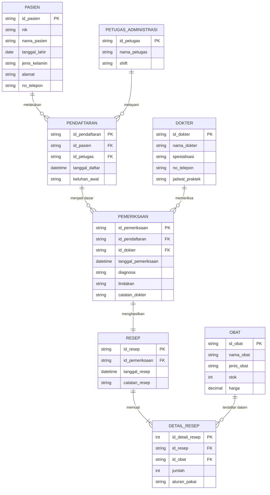

# Laporan Praktikum Tugas 1: Perancangan Entity Relationship Diagram (ERD) Sistem Rumah Sakit

**Mata Kuliah:** MSIM4206 – Basis Data  
**Program Studi:** Sistem Informasi / Informatika – Universitas Terbuka  
**Nama Mahasiswa:** Farhan Aditya  
**NIM:** 054750333  

---

## 1. Deskripsi Kasus

Sebuah rumah sakit memiliki banyak dokter. Setiap dokter mempunyai banyak pasien yang harus ditangani. Pasien harus terlebih dahulu mendaftar pada bagian administrasi dengan menyerahkan data dirinya. Data pasien yang telah terdaftar akan diserahkan kepada dokter untuk diperiksa. Pasien dapat diperiksa oleh beberapa dokter sesuai situasi dan kondisi pasien. Setelah pasien selesai diperiksa, dokter akan membuat resep obat dan diserahkan kepada pasien.

---

## 2. Tahapan Perancangan ERD (Mengacu pada BMP MSIM4206)

Perancangan basis data konseptual dilakukan melalui tahapan sistematis berikut:

```
[Tahap 1: Identifikasi Entitas]
               │
               ▼
[Tahap 2: Menentukan Atribut & Primary Key]
               │
               ▼
[Tahap 3: Menentukan Relasi & Kardinalitas]
               │
               ▼
[Tahap 4: Transformasi Relasi Many-to-Many]
               │
               ▼
[Tahap 5: Pembuatan ERD (Konseptual & Logikal)]
               │
               ▼
[Tahap 6: Pembentukan Skema Relasional (Tabel & FK)]
```

### Tahap 1: Menentukan Entitas (Entity Identification)

Dari narasi kasus di atas, entitas utama (*strong entity*) dan entitas transaksi (*associative entity*) yang terlibat meliputi:

1. **Dokter**: Tenaga medis yang bertugas memeriksa pasien dan meresepkan obat.
2. **Pasien**: Pengguna layanan medis yang mendaftar dan menerima tindakan pemeriksaan serta resep.
3. **Petugas Administrasi**: Petugas rumah sakit yang melayani registrasi awal data diri pasien.
4. **Pendaftaran**: Entitas pencatatan sesi pendaftaran pasien oleh bagian administrasi.
5. **Pemeriksaan**: Entitas transaksi/asosiatif untuk menangani relasi *Many-to-Many* antara Dokter dan Pasien (mencatat sesi periksa, diagnosa, dan tindakan).
6. **Resep**: Dokumen medis yang dibuat oleh dokter setelah sesi pemeriksaan.
7. **Obat**: Master data obat-obatan yang tersedia di instalasi farmasi rumah sakit.
8. **Detail Resep**: Entitas asosiatif untuk menangani relasi *Many-to-Many* antara Resep dan Obat (mencatat jumlah dan dosis obat yang diberikan).

---

### Tahap 2: Menentukan Atribut dan Primary Key

Setiap entitas memiliki atribut deskriptif dengan salah satu atribut bertindak sebagai *Primary Key* (PK):

| Entitas | Primary Key (PK) | Atribut Deskriptif |
| :--- | :--- | :--- |
| **Dokter** | `id_dokter` | `nama_dokter`, `spesialisasi`, `no_telepon`, `jadwal_praktek` |
| **Petugas Administrasi** | `id_petugas` | `nama_petugas`, `shift` |
| **Pasien** | `id_pasien` | `nik`, `nama_pasien`, `tanggal_lahir`, `jenis_kelamin`, `alamat`, `no_telepon` |
| **Pendaftaran** | `id_pendaftaran` | `id_pasien` (FK), `id_petugas` (FK), `tanggal_daftar`, `keluhan_awal` |
| **Pemeriksaan** | `id_pemeriksaan` | `id_pendaftaran` (FK), `id_dokter` (FK), `tanggal_pemeriksaan`, `diagnosa`, `tindakan`, `catatan_dokter` |
| **Resep** | `id_resep` | `id_pemeriksaan` (FK), `tanggal_resep`, `catatan_resep` |
| **Obat** | `id_obat` | `nama_obat`, `jenis_obat`, `stok`, `harga` |
| **Detail Resep** | `id_detail_resep` | `id_resep` (FK), `id_obat` (FK), `jumlah`, `aturan_pakai` |

---

### Tahap 3: Menentukan Relasi dan Rasio Kardinalitas

Aturan bisnis dari studi kasus menghasilkan relasi-relasi berikut:

1. **Pasien mendaftar ke Petugas Administrasi (`Pendaftaran`)**
   - **Kardinalitas:** $1 : N$ (Satu pasien dapat memiliki beberapa riwayat pendaftaran kunjungan; satu petugas administrasi dapat melayani banyak pendaftaran pasien).
2. **Dokter menangani Pasien (`Pemeriksaan`)**
   - Kalimat kasus: *"Setiap dokter mempunyai banyak pasien yang harus ditangani... Pasien dapat diperiksa oleh beberapa dokter sesuai situasi dan kondisi pasien."*
   - **Kardinalitas:** $M : N$ (*Many-to-Many*).
   - **Solusi:** Relasi $M:N$ tidak dapat langsung diimplementasikan pada basis data relasional. Relasi ini dinormalisasi menjadi entitas transaksi `Pemeriksaan` dengan derajat $1 : N$ dari `Dokter` ke `Pemeriksaan` dan $1 : N$ dari `Pendaftaran/Pasien` ke `Pemeriksaan`.
3. **Pemeriksaan menghasilkan Resep**
   - Kalimat kasus: *"Setelah pasien selesai diperiksa, dokter akan membuat resep obat dan diserahkan kepada pasien."*
   - **Kardinalitas:** $1 : 1$ (Satu sesi pemeriksaan spesifik menghasilkan satu formulir resep obat).
4. **Resep memuat Obat (`Detail_Resep`)**
   - Satu resep dapat memuat lebih dari satu jenis obat, dan satu jenis obat dapat diresepkan ke banyak lembar resep.
   - **Kardinalitas:** $M : N$ (*Many-to-Many*).
   - **Solusi:** Dinormalisasi menjadi entitas perantara `Detail_Resep`.

---

## 3. Entity Relationship Diagram (ERD)

Diagram di bawah ini digambarkan menggunakan standar Crow's Foot Notation dalam format **Mermaid**.  
*(Diagram dapat langsung dilihat visualnya di Antigravity IDE dengan membuka Markdown Preview: `Ctrl+Shift+V`)*.



---

## 4. Skema Relasional (Tabel & Foreign Key)

Transformasi dari ERD ke skema relasional tabel fisik:

1. **`pasien`** (`id_pasien` [PK], `nik`, `nama_pasien`, `tanggal_lahir`, `jenis_kelamin`, `alamat`, `no_telepon`)
2. **`petugas_administrasi`** (`id_petugas` [PK], `nama_petugas`, `shift`)
3. **`dokter`** (`id_dokter` [PK], `nama_dokter`, `spesialisasi`, `no_telepon`, `jadwal_praktek`)
4. **`pendaftaran`** (`id_pendaftaran` [PK], `id_pasien` [FK $\to$ pasien], `id_petugas` [FK $\to$ petugas_administrasi], `tanggal_daftar`, `keluhan_awal`)
5. **`pemeriksaan`** (`id_pemeriksaan` [PK], `id_pendaftaran` [FK $\to$ pendaftaran], `id_dokter` [FK $\to$ dokter], `tanggal_pemeriksaan`, `diagnosa`, `tindakan`, `catatan_dokter`)
6. **`resep`** (`id_resep` [PK], `id_pemeriksaan` [FK $\to$ pemeriksaan], `tanggal_resep`, `catatan_resep`)
7. **`obat`** (`id_obat` [PK], `nama_obat`, `jenis_obat`, `stok`, `harga`)
8. **`detail_resep`** (`id_detail_resep` [PK], `id_resep` [FK $\to$ resep], `id_obat` [FK $\to$ obat], `jumlah`, `aturan_pakai`)

*File DDL SQL siap dieksekusi tersedia di: [`skema_rumah_sakit.sql`](skema_rumah_sakit.sql)*

---

## 5. Panduan Visualisasi ERD di Antigravity IDE

Terdapat 2 cara membuka dan melihat ERD ini di Antigravity IDE menggunakan ekstensi yang telah terpasang:

### Opsi A: Markdown Mermaid Preview (Ekstensi `bierner.markdown-mermaid`)
1. Buka file [`laporan_tugas_1.md`](laporan_tugas_1.md).
2. Tekan tombol **Open Preview to the Side** di pojok kanan atas editor, atau gunakan pintasan keyboard:
   - **Linux / Windows:** `Ctrl + Shift + V` atau `Ctrl + K, V`
3. Diagram Mermaid di Bagian 3 akan otomatis dirender sebagai grafik visual interaktif.

### Opsi B: GUI Visual ERD Editor (Ekstensi `dineug.vuerd-vscode`)
1. Buka file diagram interaktif: [`erd_rumah_sakit.vuerd.json`](erd_rumah_sakit.vuerd.json).
2. File akan otomatis terbuka dalam format kanvas grafis (GUI) interaktif. Anda dapat menggeser (*pan*), memperbesar/memperkecil (*zoom*), melihat relasi foreign key, hingga meng-export ke format gambar PNG/SVG atau SQL DDL.

---

## 6. Naskah Video Praktikum (Sesuai Panduan Pelaporan UT)

Gunakan naskah berikut untuk perekaman video tugas sesuai syarat elemen wajib:

### a. Perkenalan Identitas Mahasiswa (Durasi: ~30-45 detik)
> *"Halo, perkenalkan nama saya Farhan Aditya dengan NIM 054750333, mahasiswa program studi Sistem Informasi Universitas Terbuka. Pada video ini, saya akan mempresentasikan hasil pengerjaan Tugas 1 Praktikum Basis Data (MSIM4206) mengenai perancangan Entity Relationship Diagram (ERD) untuk sistem informasi rumah sakit."*

### b. Langkah-Langkah Praktik & Aktivitas Mahasiswa (Durasi: ~2-3 menit)
*(Tampilkan layar IDE yang memperlihatkan dokumen perancangan dan diagram ERD)*
> *"Langkah-langkah yang saya lakukan dalam merancang basis data ini mengacu pada BMP MSIM4206, yaitu:*
> 1. *Mengidentifikasi entitas utama dari studi kasus, yaitu Dokter, Pasien, Petugas Administrasi, Pemeriksaan, Resep, dan Obat.*
> 2. *Menentukan atribut dan Primary Key untuk setiap entitas, seperti `id_dokter`, `id_pasien`, dan `id_pendaftaran`.*
> 3. *Menganalisis kardinalitas relasi, di mana relasi antara Dokter dan Pasien bersifat Many-to-Many karena satu dokter menangani banyak pasien, dan satu pasien dapat diperiksa oleh beberapa dokter.*
> 4. *Menormalisasi relasi Many-to-Many tersebut menjadi entitas transaksi Pemeriksaan, serta memecah relasi Resep dan Obat menggunakan entitas asosiatif Detail Resep.*
> 5. *Menyusun ERD dengan notasi relasi Crow's Foot dan mentransformasikannya ke dalam skema fisik tabel basis data relasional."*

### c. Hasil Praktik yang Telah Dilakukan (Durasi: ~1-2 menit)
*(Sorot diagram Mermaid di preview markdown dan skema SQL di `skema_rumah_sakit.sql`)*
> *"Berikut adalah hasil rancangan ERD yang telah dibuat. Terlihat bahwa alur dimulai dari Pasien yang mendaftar melalui Petugas Administrasi menghasilkan data Pendaftaran. Berdasarkan pendaftaran tersebut, Dokter melakukan Pemeriksaan yang mencatat diagnosa dan tindakan. Setelah pemeriksaan selesai, Dokter menerbitkan Resep yang berisi rincian obat pada tabel Detail Resep. Seluruh skema tabel beserta constraint Primary Key dan Foreign Key juga telah diuji pada file skrip SQL `skema_rumah_sakit.sql`."*

### d. Kata-Kata Penutup (Durasi: ~30 detik)
> *"Demikian presentasi laporan praktikum Tugas 1 Basis Data ini saya sampaikan. Semoga penjelasan dan rancangan ERD ini telah memenuhi seluruh ketentuan yang dipersyaratkan. Terima kasih atas perhatiannya, salam sejahtera dan selamat belajar."*
